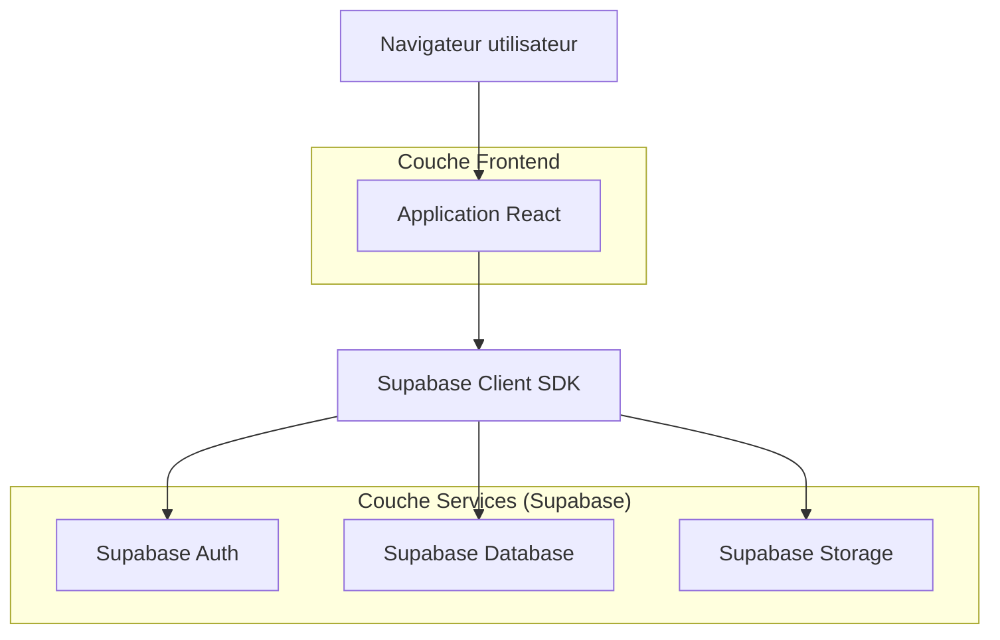
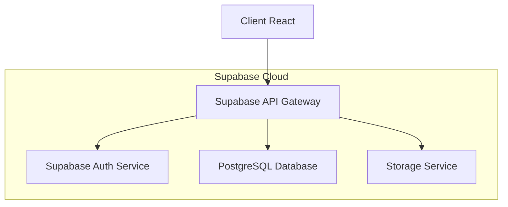
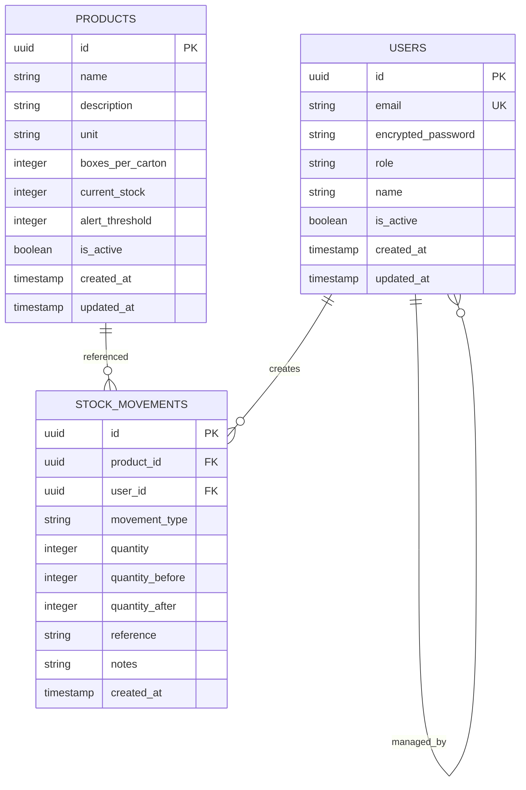

## 1. Architecture du système



## 2. Description des technologies

- **Frontend** : React@18 + Tailwind CSS@3 + Vite
- **Outil d'initialisation** : vite-init
- **Backend** : Supabase (Backend-as-a-Service)
- **Base de données** : PostgreSQL (via Supabase)
- **Authentification** : Supabase Auth
- **Stockage de fichiers** : Supabase Storage (pour les rapports PDF)

## 3. Définition des routes

| Route | Objectif |
|-------|----------|
| /login | Page d'authentification des utilisateurs |
| /dashboard | Tableau de bord principal avec vue d'ensemble des stocks |
| /products | Liste et gestion des produits |
| /products/new | Formulaire d'ajout d'un nouveau produit |
| /products/edit/:id | Formulaire de modification d'un produit |
| /stock/entries | Saisie des entrées de stock |
| /stock/distributions | Enregistrement des distributions |
| /reports | Génération et consultation des rapports |
| /admin/users | Gestion des utilisateurs (admin uniquement) |

## 4. Définitions des API

### 4.1 API d'authentification (Supabase)

```typescript
// Types TypeScript communs
interface User {
  id: string
  email: string
  role: 'volunteer' | 'admin'
  created_at: string
}

interface LoginRequest {
  email: string
  password: string
}

interface LoginResponse {
  user: User
  session: Session
  access_token: string
}
```

### 6.2 Langage de définition des données (DDL)

**Table des utilisateurs (users)**
```sql
-- création de la table
CREATE TABLE users (
    id UUID PRIMARY KEY DEFAULT gen_random_uuid(),
    email VARCHAR(255) UNIQUE NOT NULL,
    encrypted_password VARCHAR(255) NOT NULL,
    role VARCHAR(20) DEFAULT 'volunteer' CHECK (role IN ('volunteer', 'admin')),
    name VARCHAR(100) NOT NULL,
    is_active BOOLEAN DEFAULT true,
    created_at TIMESTAMP WITH TIME ZONE DEFAULT NOW(),
    updated_at TIMESTAMP WITH TIME ZONE DEFAULT NOW()
);

-- index pour améliorer les performances
CREATE INDEX idx_users_email ON users(email);
CREATE INDEX idx_users_role ON users(role);
```

**Table des produits (products)**
```sql
-- création de la table
CREATE TABLE products (
    id UUID PRIMARY KEY DEFAULT gen_random_uuid(),
    name VARCHAR(255) NOT NULL,
    description TEXT,
    unit VARCHAR(50) DEFAULT 'boîte' CHECK (unit IN ('boîte', 'carton', 'kg', 'litre')),
    boxes_per_carton INTEGER DEFAULT 1 CHECK (boxes_per_carton > 0),
    current_stock INTEGER DEFAULT 0 CHECK (current_stock >= 0),
    alert_threshold INTEGER DEFAULT 10 CHECK (alert_threshold >= 0),
    is_active BOOLEAN DEFAULT true,
    created_at TIMESTAMP WITH TIME ZONE DEFAULT NOW(),
    updated_at TIMESTAMP WITH TIME ZONE DEFAULT NOW()
);

-- index pour améliorer les performances
CREATE INDEX idx_products_name ON products(name);
CREATE INDEX idx_products_active ON products(is_active);
CREATE INDEX idx_products_stock ON products(current_stock);
```

**Table des mouvements de stock (stock_movements)**
```sql
-- création de la table
CREATE TABLE stock_movements (
    id UUID PRIMARY KEY DEFAULT gen_random_uuid(),
    product_id UUID NOT NULL REFERENCES products(id),
    user_id UUID NOT NULL REFERENCES users(id),
    movement_type VARCHAR(20) NOT NULL CHECK (movement_type IN ('entree', 'sortie')),
    quantity INTEGER NOT NULL CHECK (quantity > 0),
    quantity_before INTEGER NOT NULL,
    quantity_after INTEGER NOT NULL,
    reference VARCHAR(255),
    notes TEXT,
    created_at TIMESTAMP WITH TIME ZONE DEFAULT NOW()
);

-- index pour améliorer les performances
CREATE INDEX idx_stock_movements_product ON stock_movements(product_id);
CREATE INDEX idx_stock_movements_user ON stock_movements(user_id);
CREATE INDEX idx_stock_movements_date ON stock_movements(created_at DESC);
CREATE INDEX idx_stock_movements_type ON stock_movements(movement_type);
```

### 6.3 Politiques de sécurité Supabase

```sql
-- Politiques pour la table users (lecture seule pour les utilisateurs authentifiés)
ALTER TABLE users ENABLE ROW LEVEL SECURITY;

CREATE POLICY "Les utilisateurs peuvent voir leur propre profil" ON users
    FOR SELECT USING (auth.uid() = id);

CREATE POLICY "Les administrateurs peuvent voir tous les utilisateurs" ON users
    FOR SELECT USING (
        EXISTS (
            SELECT 1 FROM users 
            WHERE id = auth.uid() AND role = 'admin'
        )
    );

-- Politiques pour la table products (accès selon les rôles)
ALTER TABLE products ENABLE ROW LEVEL SECURITY;

CREATE POLICY "Tous les utilisateurs authentifiés peuvent lire les produits" ON products
    FOR SELECT USING (is_active = true);

CREATE POLICY "Les administrateurs peuvent gérer les produits" ON products
    FOR ALL USING (
        EXISTS (
            SELECT 1 FROM users 
            WHERE id = auth.uid() AND role = 'admin'
        )
    );

-- Politiques pour la table stock_movements (gestion des mouvements)
ALTER TABLE stock_movements ENABLE ROW LEVEL SECURITY;

CREATE POLICY "Les utilisateurs peuvent créer des mouvements" ON stock_movements
    FOR INSERT WITH CHECK (auth.uid() = user_id);

CREATE POLICY "Les utilisateurs peuvent voir les mouvements" ON stock_movements
    FOR SELECT USING (
        EXISTS (
            SELECT 1 FROM users 
            WHERE id = auth.uid() AND is_active = true
        )
    );

-- Attribution des droits
GRANT SELECT ON users TO authenticated;
GRANT SELECT ON products TO authenticated;
GRANT ALL ON stock_movements TO authenticated;
```

### 4.2 API de gestion des stocks

**Produits**
```
GET /rest/v1/products
POST /rest/v1/products
PATCH /rest/v1/products?id=eq.{id}
DELETE /rest/v1/products?id=eq.{id}
```

**Mouvements de stock**
```
GET /rest/v1/stock_movements
POST /rest/v1/stock_movements
```

## 5. Architecture serveur



## 6. Modèle de données

### 6.1 Schéma de la base de données

