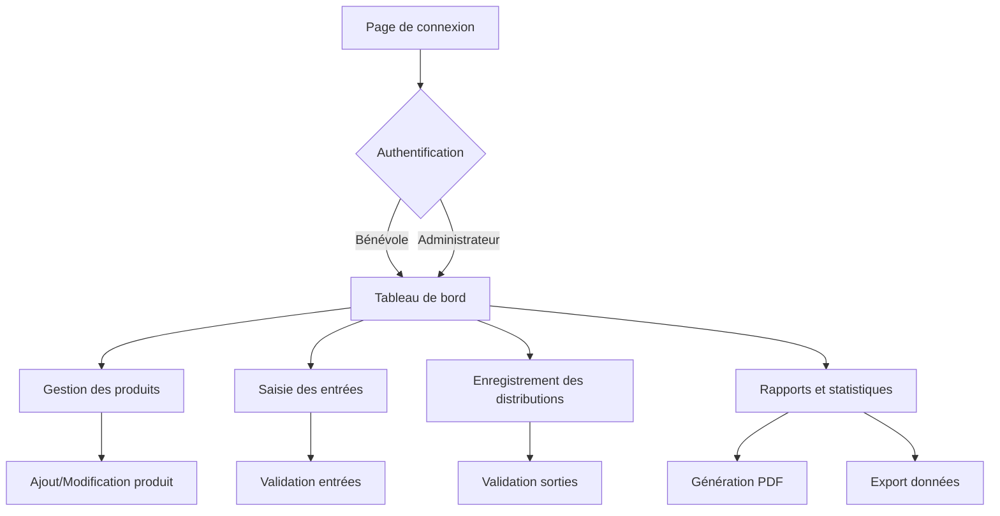

## 1. Vue d'ensemble du produit

Application web de gestion des stocks alimentaires pour le Secours Populaire Français, permettant aux bénévoles de suivre les entrées et sorties de produits de manière simple et sécurisée.

L'application résout le problème de gestion manuelle des stocks sur Excel, en offrant une solution accessible aux bénévoles non-informaticiens avec des calculs automatiques et des rapports mensuels automatisés.

## 2. Fonctionnalités principales

### 2.1 Rôles utilisateurs

| Rôle | Méthode d'inscription | Permissions principales |
|------|----------------------|------------------------|
| Bénévole | Création par administrateur | Consulter et modifier les stocks, enregistrer des entrées/sorties |
| Administrateur | Compte principal système | Gérer les utilisateurs, accéder aux rapports, paramétrer l'application |

### 2.2 Module des fonctionnalités

L'application de gestion des stocks comprend les pages principales suivantes :

1. **Page de connexion** : authentification sécurisée, récupération de mot de passe
2. **Tableau de bord** : vue d'ensemble des stocks, alertes de niveau bas, raccourcis vers les actions principales
3. **Gestion des produits** : liste des produits, ajout/modification/suppression, recherche et filtres
4. **Saisie des entrées** : formulaire d'enregistrement des réceptions par cartons avec calcul automatique du nombre de boîtes
5. **Enregistrement des distributions** : comptage des sorties en boîtes, sélection du produit et quantité
6. **Rapports et statistiques** : génération de rapports mensuels PDF, graphiques d'évolution des stocks, export des données

### 2.3 Détail des pages

| Page | Module | Description fonctionnelle |
|------|--------|---------------------------|
| Connexion | Formulaire d'authentification | Saisir login/mot de passe, validation sécurisée, lien de récupération du mot de passe |
| Tableau de bord | Vue d'ensemble | Afficher les stocks actuels, produits en alerte (niveau < 10%), graphique des mouvements récents |
| Tableau de bord | Menu navigation | Barre latérale avec icônes explicites, accès rapide aux fonctions principales |
| Gestion des produits | Liste des produits | Tableau avec nom, quantité actuelle, unité, seuil d'alerte, actions rapides |
| Gestion des produits | Ajout/Modification | Formulaire avec nom, description, unité (boîte/carton), quantité par carton, seuil d'alerte |
| Saisie des entrées | Formulaire de réception | Sélection du produit, nombre de cartons reçus, calcul auto du total boîtes, date et commentaire |
| Enregistrement des distributions | Formulaire de sortie | Sélection du produit, quantité en boîtes distribuées, calcul auto du stock restant, date et bénéficiaire |
| Rapports | Rapport mensuel | Génération PDF avec tableau des mouvements du mois, graphiques d'évolution, produits les plus distribués |
| Rapports | Export des données | Bouton d'export CSV/Excel des données de stock, filtres par période et produit |

## 3. Processus principaux

### Flux bénévole
1. Connexion avec ses identifiants
2. Consultation du tableau de bord pour voir l'état des stocks
3. En cas de réception de dons : saisie des entrées via le formulaire dédié
4. Lors des distributions : enregistrement des sorties par produit
5. Consultation éventuelle des rapports pour voir l'activité du mois

### Flux administrateur
1. Connexion avec ses identifiants administrateur
2. Gestion des comptes bénévoles (création, modification, suppression)
3. Configuration des produits et paramètres de stock
4. Génération et consultation des rapports mensuels
5. Export des données pour les comptes annuels

## 4. Interface utilisateur

### 4.1 Style de design
- **Couleurs principales** : Bleu Secours Populaire (#0066CC) et blanc, avec accents orange (#FF6600) pour les actions importantes
- **Couleurs secondaires** : Gris clair (#F5F5F5) pour les fonds, vert (#28A745) pour les validations, rouge (#DC3545) pour les alertes
- **Style des boutons** : Boutons arrondis avec ombres portées, taille minimum 44px pour le tactile
- **Typographie** : Police sans-serif (Arial ou system-ui), taille 16px minimum, hiérarchie claire avec titres H1=24px, H2=20px, H3=18px
- **Mise en page** : Cartes espacées, grille fluide, navigation latérale rétractable sur desktop, menu hamburger sur mobile
- **Icônes** : Style Material Design, couleurs unies, taille 24px standard

### 4.2 Aperçu du design des pages

| Page | Module | Éléments d'interface |
|------|--------|----------------------|
| Connexion | Formulaire | Carte centrée, logo SPF, champs larges, bouton principal visible, lien mot de passe oublié |
| Tableau de bord | Vue d'ensemble | Cartes de statistiques avec icônes, graphique en barres des mouvements, tableau des alertes avec codes couleurs |
| Gestion des produits | Liste | Tableau responsive avec scrollbar horizontale, boutons d'action iconographiques, badge de quantité |
| Saisie des entrées | Formulaire | Champs avec labels explicites, sélecteur de produit avec recherche, calcul en temps réel |
| Rapports | PDF | Aperçu avant téléchargement, sélection de période avec datepicker, boutons d'action clairs |

### 4.3 Responsive design
Approche **desktop-first** avec adaptation progressive vers tablette et mobile :
- Desktop (1200px+) : Navigation latérale complète, tableaux avec toutes les colonnes
- Tablette (768px-1199px) : Navigation rétractable, tableaux adaptatifs
- Mobile (<768px) : Menu hamburger, cartes empilées, formulaires en une colonne
Optimisation tactile avec boutons d'au moins 44x44px et espacement adapté aux doigts.

### 4.4 Accessibilité
- Contraste minimum 4.5:1 pour le texte normal, 3:1 pour le texte grand
- Navigation au clavier complète avec tabulation logique
- Labels ARIA appropriés pour les lecteurs d'écran
- Messages d'erreur explicites et aide contextuelle